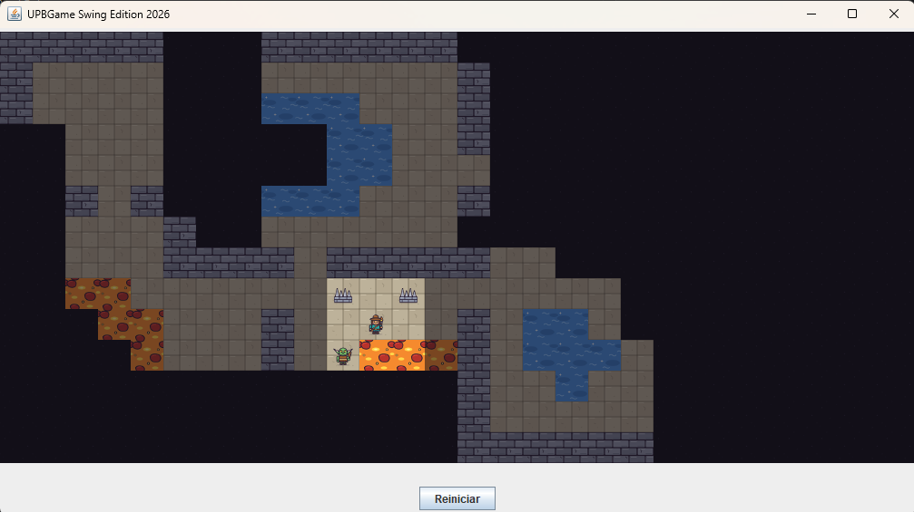

# MyFirstUPBGame

A small dungeon-exploration game in Java, built as a first programming exercise for students. All the game mechanics are already written. Students design their own dungeon by filling in **three methods**: the map, the objects and events in the world, and the player's character.

Learning how it works takes about half an hour, and building a complete game takes about an hour.



## The game

- The dungeon is a grid of **14 rows × 28 columns**. The player always starts at cell `(1,1)`.
- The player moves one cell at a time with the **arrow keys** or **W A S D**, and can't walk through walls.
- **Fog of war:** the player only sees the 8 cells around them. Cells they have already explored stay dimly visible, and unexplored cells stay dark.
- **Lives, health and coins** are optional. Each one appears on screen only if the dungeon uses an event that needs it.
- Reaching a win or lose event shows a full-screen victory or defeat image. The **Reiniciar** button restarts the game.

## Building your dungeon

Everything a student edits is in [`src/juego/MyFirstUPBGame.java`](src/juego/MyFirstUPBGame.java). Coordinates are always `(v, h)`, where `v` is the row (0–13, top to bottom) and `h` is the column (0–27, left to right).

### 1. The map: `crearMapa()`

This method returns a 14 × 28 grid of `Terreno` values:

| Terrain | Meaning |
|---|---|
| `PISO` | Floor |
| `PARED` | Wall (can't be crossed) |
| `LAVA` | Lava (walkable, so pair it with an event) |
| `AGUA` | Water (walkable) |

Border cells must be `PARED`, and the starting cell `(1,1)` can't be a wall.

### 2. The world: `construirMundo()`

Place objects on cells with `anadirElemento`, and attach events that run when the player steps onto a cell with `anadirEvento`:

```java
anadirElemento(5, 8, Elemento.TRAMPA_DE_PINCHOS);
anadirEvento(5, 8, Evento.PERDER_SALUD, 40);

anadirElemento(10, 10, Elemento.PORTAL);
anadirEvento(10, 10, Evento.TELETRANSPORTAR, 2, 14);

anadirElemento(12, 25, Elemento.PUERTA);
anadirEvento(12, 25, Evento.GANAR_JUEGO);
```

Events added with `anadirEvento` happen **every time** the player enters the cell. Use `anadirEventoUnaVez` for events that should happen **only the first time**, and `anadirElementoUnaVez` for elements that disappear once the player picks them up. You choose for each event, so one cell can mix both:

```java
anadirElementoUnaVez(4, 6, Elemento.COFRE);
anadirEventoUnaVez(4, 6, Evento.GANAR_MONEDAS, 10);
anadirEventoUnaVez(4, 6, Evento.MOSTRAR_MENSAJE, "Encontraste 10 monedas!");
anadirEvento(4, 6, Evento.PERDER_SALUD, 10); // the chest is cursed: it hurts on every visit
```

Pressing **Reiniciar** brings back every one-time event and element.

To make the exit require coins, use `GANAR_JUEGO_CON_MONEDAS` with the number of coins needed. If the player doesn't have enough, the game tells them how many they need and they can keep exploring:

```java
anadirElemento(12, 25, Elemento.PUERTA);
anadirEvento(12, 25, Evento.GANAR_JUEGO_CON_MONEDAS, 30);
```

Walls can change during the game with `PONER_PARED` (put a wall) and `QUITAR_PARED` (remove a wall). They take the cell to change, like a teleport destination. A removed wall turns back into the cell's terrain from `crearMapa()`, or `PISO` if it was a wall there. For example, a lever that opens one passage and closes another:

```java
anadirElemento(3, 12, Elemento.PALANCA);
anadirEventoUnaVez(3, 12, Evento.QUITAR_PARED, 5, 12);
anadirEventoUnaVez(3, 12, Evento.PONER_PARED, 5, 14);
```

The border walls can never change, a cell can't change its own wall, and a wall can't be put on a cell with an element. These are checked when the event is added, before the game starts.

There are more than 50 elements to choose from (`DRAGON`, `COFRE`, `FANTASMA`, `POCION_ROJA`, `PATO_DE_GOMA`, …). See [`Elemento.java`](src/juego/Elemento.java) for the full list.

| Event | Extra data | Effect | Usually |
|---|---|---|---|
| `GANAR_VIDA` / `PERDER_VIDA` | none | Gain or lose a life (start with 3, lose at 0) | gain: once · lose: every time |
| `GANAR_SALUD` / `PERDER_SALUD` | amount | Gain or lose health (max 100; at 0 you lose a life and health resets) | gain: once · lose: every time |
| `GANAR_MONEDAS` / `PERDER_MONEDAS` | amount | Gain or lose coins | gain: once · lose: every time |
| `MOSTRAR_MENSAJE` | text | Show a message | same as the other events in its cell |
| `TELETRANSPORTAR` | destination row, column | Move the player to another cell | every time |
| `PONER_PARED` / `QUITAR_PARED` | row, column of the wall | Put or remove a wall in another cell (not on the border) | once |
| `GANAR_JUEGO` / `PERDER_JUEGO` | none | Show the victory or defeat screen | either (the game ends) |
| `GANAR_JUEGO_CON_MONEDAS` | amount | Win only if the player has at least that many coins (they aren't spent); otherwise show how many are needed and keep playing | every time |

A cell can have several events. They all happen together when the player enters, so the order you add them in doesn't matter, and a cell's events can't contradict each other:

- A cell can't have the same event twice, whether it was added with `anadirEvento` or `anadirEventoUnaVez`. This includes two messages or two teleports. The exception is `PONER_PARED` and `QUITAR_PARED`: a cell can change several walls, but not the same wall twice, and it can't both put and remove the same wall.
- A cell can't mix opposite events: `GANAR_VIDA` with `PERDER_VIDA`, `GANAR_SALUD` with `PERDER_SALUD`, or `GANAR_MONEDAS` with `PERDER_MONEDAS`.
- `GANAR_JUEGO`, `GANAR_JUEGO_CON_MONEDAS` and `PERDER_JUEGO` must be the only event in their cell.

`TELETRANSPORTAR` happens after the cell's other events. Then the player enters the destination cell as if they had walked in: its events run too (and a one-time element there disappears), so teleports can chain. A teleport whose destination was already visited in the same chain doesn't happen, and the player stays where they are. This is what makes two-way portals work: from A you land on B, and B's teleport back to A is skipped. A teleport whose destination has been turned into a wall by `PONER_PARED` doesn't happen either. A one-time teleport that gets skipped this way isn't used up.

Keep cells in a teleport chain simple: avoid adding other events to them, because they'll run every time the player passes through.

### 3. The character: `getPersonaje()`

Return `PERSONAJE1`, `PERSONAJE2` or `PERSONAJE3` to pick one of the three adventurers.

The game checks what students write: placing an element on a wall, using a cell outside the grid, leaving a gap in the border wall, or breaking one of the event rules above stops the game. As soon as the window opens, it shows a clear error message in Spanish and, when it can, the line of `MyFirstUPBGame.java` to fix. The full error is still printed in the console.

## Running the game

You need **Java 8 or later**. The entry point is `base.LaunchMyFirstUPBGame`.

**In an IDE (Eclipse, IntelliJ, VS Code):** open the project, add `lib/upb-game.jar` to the classpath, mark `src` as the source folder, and run `LaunchMyFirstUPBGame`. Run it with the project root as the working directory so the game can find `resources/images`.

**From the command line**, at the project root:

```bash
# Windows
javac -cp lib/upb-game.jar -d bin src/base/*.java src/juego/*.java
java -cp "bin;lib/upb-game.jar" base.LaunchMyFirstUPBGame

# macOS / Linux
javac -cp lib/upb-game.jar -d bin src/base/*.java src/juego/*.java
java -cp "bin:lib/upb-game.jar" base.LaunchMyFirstUPBGame
```

## Sharing a finished game

Two scripts at the project root build a version of the game that other people can play. Both need a JDK on the PATH and run in Git Bash on Windows or in a terminal on macOS and Linux.

- **`./build.sh`** creates `MyFirstUPBGame.jar`. Anyone with **Java 8 or later** can play it by double-clicking it or running `java -jar MyFirstUPBGame.jar`.
- **`./package.sh`** creates `dist/MyFirstUPBGame-windows.zip` (or `-macos.zip`), which contains the game and its own Java runtime. Players **don't need Java installed**: they unzip it and launch `MyFirstUPBGame.exe` (or `MyFirstUPBGame.app`). It needs JDK 17 or later to build. If it says `jpackage` is not found, set `JAVA_HOME` to your JDK folder (for example `export JAVA_HOME="/c/Program Files/Java/jdk-21"`) and run it again.

Things to know before sharing the zip:

- It only runs on the operating system it was built on. Build the macOS version on a Mac.
- The app isn't signed. On Windows, SmartScreen may block it: click **More info → Run anyway**. On macOS, right-click the app and choose **Open**.

## Project structure

```
src/
  juego/   ← student code: MyFirstUPBGame.java plus the Terreno, Elemento, Evento and Personaje enums
  base/    ← game engine (MyFirstUPBGameBase) and launcher; students don't need to touch it
lib/       ← upb-game.jar, the UPB-Game-Swing graphics/input library
resources/images/ ← sprites for terrain, elements, characters and the win/lose screens
```

## Credits

The graphics, input and windowing come from the [UPB-Game-Swing](https://github.com/RobertoCuevasP/UPB-Game-Swing) library by Roberto Cuevas and Alexis Marechal, included here as `lib/upb-game.jar`.

## License

[MIT](LICENSE) © 2026 Alexis Marechal
